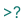
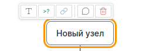

# Введение
Это приложение предназначено для структурирования информации в виде mind map

Среди особенностей - ориентация на использование mind maps для обучения, и способность взаимодействовать с нейронными сетями (LLM).

Это офлайн-приложение, написанное на Javascript. Данные сохраняются локально в кэше браузера, доступен импорт/экспорт данных в JSON-формате.
# Работа со схемой
Приложение позволяет организовывать информацию в виде иерархии узлов. Корневой узел один, дочерние "растут" от него в четырех направлениях.\
Существует несколько типов узлов:
 -  текстовый узел.  Используется чаще всего
 -  ссылка. Хранит ссылку на страницу в Интернет
 -  тест. Используется для хранения тестов.


Можно создавать узлы всех типов, редактировать - все, кроме тестового. "Наполнение" тестового узла данными производится с помощью LLM. 

Также к каждому узлу можно добавлять текстовый комментарий ()

\
Панель, которая появляется при наведении мыши на узел, позволяет:
 - создать дочерний узел одного из трех типов
 - добавить комментарий
 - удалить текущий узел.\
Также к узлам можно прикреплять заметки — для этого используется боковая панель ().

# Интерфейс системы

На панели сверху расположены кнопки основных действий, объединенные в группы. Группа "Узлы" отвечает за работу с узлами схемы. Кнопки группы "Сведения" позволяют управлять отображением справки и боковой панели\
 (Показать/убрать справку)\
 (Показать/убрать боковую панель)\
Кнопки группы "Схема" предназначены работы с данными схемы: загрузки, сохранения и очистки.\
 Загрузка данных в формате JSON\
 Выгрузка  данных в формате JSON в файл\
 Очистка данных схемы\

Кнопка "Тема" группы "Инструменты" позволяет переключаться между светлой и темной темами интерфейса\
 Переключить тему

# Работа с LLM в режиме чата
Самый простой способ начать работать с программой - использовать чат какой-либо нейронной сети. Нужно прикрепить к сообщению чата файл описания формата DATA_FORMAT.md, после чего "попросить" нейросеть создать схему с нужными вам данными. Например для создания схемы изучения регулярных выражений языка Python можно написать:
```
Я передаю тебе описание формата данных Mind Map. Реализуй схему для изучения регулярных выражений с примерами на языке Python 3. Проставь ссылки на источники. Не забудь тесты.
```
После чего дождаться завершения вывода нейросети, скопировать сгенерированные JSON-данные в файл и загрузить его с помощью кнопки\
"Импорт JSON".\
Если всё прошло нормально, схема откроется для редактирования. Для запуска тестов (если такие есть), нужно выделить узел с тестом, открыть боковую панель, после чего нажать на кнопку "Начать тест". \
```
Внимание!
Нейросети могут и любят галлюцинировать. Вполне вероятно, что созданная схема будет содержать ошибки. Используйте её как "отправную точку" для работы.
```